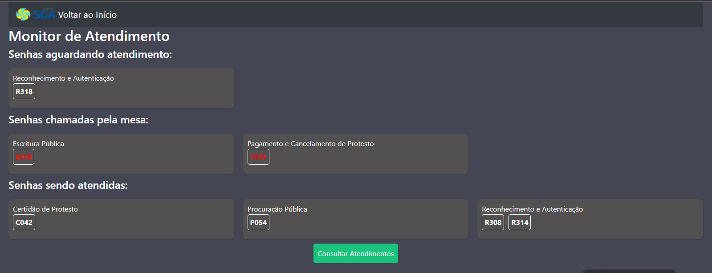
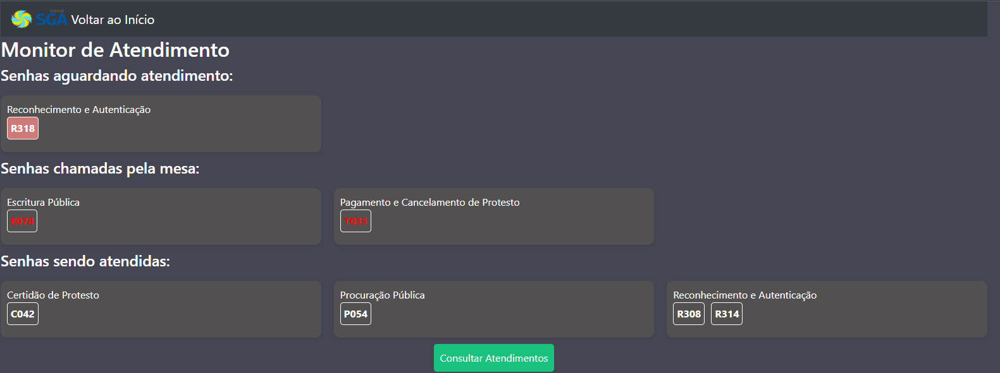
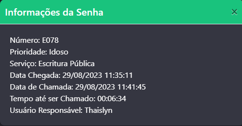
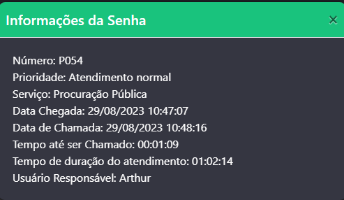
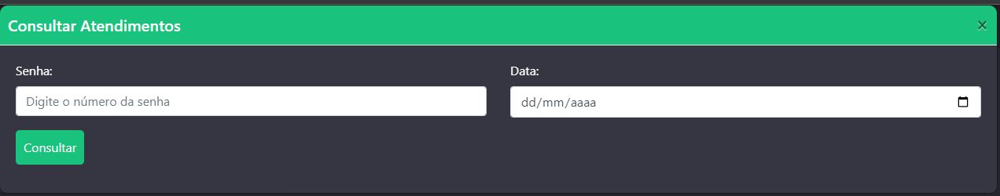
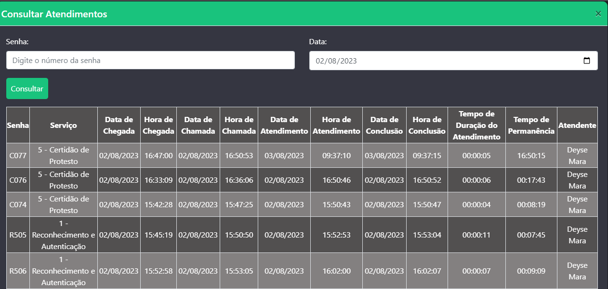

# Monitor 2.0 - NovoSGA 1.5

Esse projeto é uma extensão para utilizar em conjunto com o [NovoSGA](https://github.com/novosga/novosga)


Monitor para melhor visualização das senhas aguardando atendimento.

Incluí algumas funcionalidades adicionais que não existem no monitor antigo.

Funciona em paralelo com o Monitor atual do NovoSGA

Instalação:

Selecione a versão de acordo com a sua necessidade, elaborei uma versão para senhas continuas, e uma para incrementais por serviço que estão separadas.

Extraia a pasta desejada para dentro do SGA, ou de uma pasta que seja acessável pelo navegador

Faça os ajustes necessários nos seguintes arquivos:

sga/templates/home.html.twig 
Linha 25
```
<li>
  <a href="http://caminhodoseuservidor/nomedapastaaondedescompactou/monitor.php">
  
  <span class="name">Monitor 3.0</span>
  </a>
</li>
```

monitor.php
Alterar dados de conexão com o MySQL

linha 5
```
<link rel="shortcut icon" href="http://caminhodoseuservidor/sga/public/images/favicon.png" type="image/x-icon" />
```
linha 12
```
<!-- NavBar para voltar ao SGA -->
<nav class="navbar navbar-dark bg-dark">
  <a class="navbar-brand" href="http://caminhodoseuservidor/sga/public">
    
    Voltar ao Início
  </a>
</nav>
```
atendimentos.php
Alterar dados de conexão com o MySQL

Criação da View

Versão continua
```
CREATE OR REPLACE VIEW view_historico_atendimentos_completo AS
SELECT
    CONCAT(ha.sigla_senha, LPAD(ha.num_senha, 3, '0')) AS numero,
    s.nome AS servico,
    DATE_FORMAT(ha.dt_cheg, '%d/%m/%Y') AS data_de_chegada,
    DATE_FORMAT(ha.dt_cheg, '%H:%i:%s') AS hora_de_chegada,
    DATE_FORMAT(ha.dt_cha, '%d/%m/%Y') AS data_de_chamada,
    DATE_FORMAT(ha.dt_cha, '%H:%i:%s') AS hora_de_chamada,
    DATE_FORMAT(ha.dt_ini, '%d/%m/%Y') AS data_de_atendimento,
    DATE_FORMAT(ha.dt_ini, '%H:%i:%s') AS hora_de_atendimento,
    DATE_FORMAT(ha.dt_fim, '%d/%m/%Y') AS data_de_conclusao,
    DATE_FORMAT(ha.dt_fim, '%H:%i:%s') AS hora_de_conclusao,
    u.nome AS atendente,
    TIMEDIFF(ha.dt_fim, ha.dt_ini) AS tempo_de_duracao_do_atendimento,
    TIMEDIFF(ha.dt_fim, ha.dt_cheg) AS tempo_de_permanencia
FROM
    historico_atendimentos ha
JOIN
    servicos s ON ha.servico_id = s.id
JOIN
    usuarios u ON ha.usuario_id = u.id;
```

Versão incremental por serviço
```
CREATE OR REPLACE VIEW view_historico_atendimentos_completo AS
SELECT
    CONCAT(ha.sigla_senha, LPAD(ha.num_senha_serv, 3, '0')) AS numero,
    s.nome AS servico,
    DATE_FORMAT(ha.dt_cheg, '%d/%m/%Y') AS data_de_chegada,
    DATE_FORMAT(ha.dt_cheg, '%H:%i:%s') AS hora_de_chegada,
    DATE_FORMAT(ha.dt_cha, '%d/%m/%Y') AS data_de_chamada,
    DATE_FORMAT(ha.dt_cha, '%H:%i:%s') AS hora_de_chamada,
    DATE_FORMAT(ha.dt_ini, '%d/%m/%Y') AS data_de_atendimento,
    DATE_FORMAT(ha.dt_ini, '%H:%i:%s') AS hora_de_atendimento,
    DATE_FORMAT(ha.dt_fim, '%d/%m/%Y') AS data_de_conclusao,
    DATE_FORMAT(ha.dt_fim, '%H:%i:%s') AS hora_de_conclusao,
    u.nome AS atendente,
    TIMEDIFF(ha.dt_fim, ha.dt_ini) AS tempo_de_duracao_do_atendimento,
    TIMEDIFF(ha.dt_fim, ha.dt_cheg) AS tempo_de_permanencia
FROM
    historico_atendimentos ha
JOIN
    servicos s ON ha.servico_id = s.id
JOIN
    usuarios u ON ha.usuario_id = u.id;
```

## Algumas imagens do projeto







